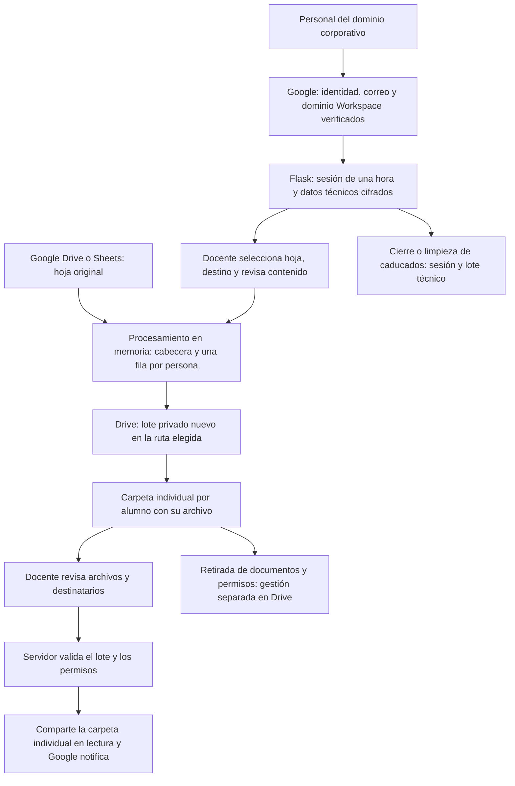

# Trasladar notas

Aplicación Flask para generar documentos individuales de evaluación a partir de una hoja de Google Drive y entregarlos tras revisión docente.

**Antes de actualizar:** lee [la guía de privacidad, funcionamiento y despliegue](docs/PRIVACIDAD_Y_ACTUALIZACION.md). Incluye el diagrama, la configuración necesaria, los cambios de comportamiento y los requisitos pendientes del centro.

El acceso se permite a cuentas Google Workspace verificadas del dominio corporativo configurado en `TEACHER_DOMAIN`, sin lista individual de correos. En Cuatrovientos, `cuatrovientos.org` corresponde al personal; el centro debe autorizar este alcance de uso. Cada persona conserva únicamente los permisos de su propia cuenta de Drive. Se crea un lote privado en la ruta de Drive elegida, con una carpeta y un archivo por alumno; la carpeta individual se comparte con su destinatario en modo lectura. El servidor vincula cada lote a la sesión que lo creó. Se requiere revisión humana de las cabeceras, todas las columnas, comentarios y destinatarios.

Las plantillas y pestañas adicionales están deshabilitadas; no se copian fórmulas ni se reutilizan carpetas. Las calificaciones de Drive y las descargas requieren una política de conservación del centro. El borrado de sesiones no elimina esos documentos.

Instalación: `pip install -r requirements.txt`, completar `.env` a partir de `.env.example` y configurar WSGI con `from wsgi import application`. No ejecutar la versión histórica del cuaderno ni servir el `index.html` de la raíz como aplicación.

Pruebas sin Google real: `pip install -r requirements-dev.txt` y `python -m pytest tests -q`.

## Adecuación al RGPD

Documentación revisada el 9 de octubre de 2026 a partir de los diagramas del informe inicial y del código actual. Describe las medidas implementadas; la configuración y autorización de producción deben comprobarse aparte.

El acceso requiere una identidad Google Workspace verificada del dominio corporativo configurado, sin lista individual de correos. Cada usuario opera con sus propios permisos de Drive. Los archivos se procesan en memoria; las sesiones y los lotes técnicos se guardan cifrados en el servidor, con caducidad de una hora. La revisión docente precede a la compartición en lectura de la carpeta individual de cada alumno. Cerrar sesión elimina datos técnicos, pero no los documentos ni los permisos de Drive: el centro debe gestionar su conservación y retirada.

Estos controles apoyan la adecuación al RGPD, pero no acreditan por sí solos el cumplimiento ni sustituyen la autorización del centro. Antes del uso con datos reales deben verificarse en el despliegue, completar la información de privacidad, revisar proveedores y condiciones de tratamiento y aprobar la conservación y el borrado, incluidas copias y exportaciones.

La página `/privacidad` muestra `PRIVACY_CONTROLLER`, `PRIVACY_CONTACT`, `PRIVACY_LEGAL_BASIS`, `PRIVACY_RETENTION` y `PRIVACY_PROVIDERS`, configuradas en el `.env` de cada despliegue (`backend/.env` en Generador de equipos). `PRIVACY_RETENTION` es texto informativo y no activa el borrado. Consulta los plazos y comandos operativos en la guía específica.

[Guía de privacidad](docs/PRIVACIDAD_Y_ACTUALIZACION.md) · [Web](https://trasladarnotas.eu.pythonanywhere.com/).

El enlace utiliza el nuevo dominio europeo. La migración está en curso según la información disponible; debe confirmarse su finalización, la versión desplegada y el tratamiento de las copias del alojamiento anterior. Alojar en Europa no determina dónde procesan los datos otros proveedores.

## Flujo de funcionamiento y datos

