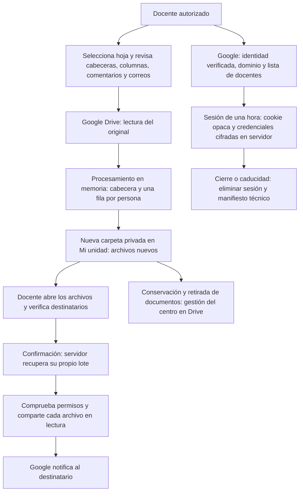

# Trasladar notas: privacidad y actualización

Revisión local: 7 de octubre de 2026. Cambios sobre `22078c462f69e3137ffabb6c9c1a738a8c51e6af`. No se ha accedido a cuentas reales, enviado notificaciones ni actualizado PythonAnywhere.

## Funcionamiento

## Cambios y límites relevantes

- No hay credenciales de Google ni listados de alumnado en la cookie. SQLite almacena los datos de sesión y de lotes cifrados con Fernet; las claves y el fichero OAuth deben estar fuera de directorios públicos y con acceso exclusivo a la cuenta del servicio. El cifrado no protege frente a quien controle a la vez servidor y claves.
- Acceso solo con ID token verificado, `email_verified`, dominio Workspace `hd`, correo de ese dominio en la lista expresa, `sub` y nonce. Estado OAuth y PKCE de un solo uso. Se conserva la identidad estable en la sesión. El acceso se verifica también en cada operación; retirar un correo exige recargar la aplicación para leer la nueva configuración.
- Sesión absoluta de una hora, flujo de acceso de diez minutos; sin conservar refresh tokens. Cerrar sesión revoca en el servidor esa sesión y sus lotes, incluidas copias de su cookie. No revoca otras sesiones del mismo docente ni la autorización de Google; usa la lista de docentes y la revocación de sesiones del servidor para una retirada completa.
- CSRF, comprobación de origen, cookies Secure/HttpOnly/SameSite, cabeceras contra caché y marcos, recursos locales y errores públicos sin trazas. El callback aún recibe un código OAuth en la URL: revisar y limitar los logs de acceso del alojamiento, que esta aplicación no controla.
- Procesamiento de XLSX en memoria: sin carpeta `output`, sin descargar hojas a rutas elegidas por el usuario y sin borrado de archivos compartidos entre tareas. Al terminar, el proceso libera referencias; esto no es una garantía de borrado físico de RAM o swap del proveedor.
- Se crea un libro limpio por persona, con valores, estilos y comentarios de la cabecera y de una fila. Se eliminan hipervínculos y autores originales de comentarios. No se copian otras hojas, nombres definidos, metadatos originales, imágenes ni fórmulas. Las fórmulas requieren resultados previamente calculados y guardados: si faltan, se detiene el trabajo. No se reconstruye todo el diseño original (p. ej. combinaciones, gráficos o agrupaciones).
- **Las cabeceras, todas las columnas de la pestaña seleccionada y el texto de los comentarios se copian**, incluso columnas ocultas. Deben revisarse y minimizarse en el original. Un número de filas de cabecera incorrecto puede incluir datos de alumnado en todas las copias. La casilla de revisión es una confirmación docente, no detección automática del contenido. Las plantillas y hojas adicionales se rechazan por este riesgo.
- Solo se admiten correos de los dominios de alumnado configurados; nombres/correos incompletos y destinatarios duplicados detienen el lote. Esto no demuestra que un correo pertenezca a la persona de la fila: es necesaria la revisión humana.
- Se conserva la búsqueda por nombre, pero se exige un resultado único. Ya no se usa una ruta de carpetas existente ni se sobrescriben archivos de ejecuciones anteriores. Cada lote crea una carpeta privada nueva en la raíz de Mi unidad y documentos nuevos; los enlaces de revisión permiten distinguir los documentos aunque tengan el mismo título.
- Antes de compartir se comprueban los permisos del lote completo. Se rechazan permisos de dominio, públicos, de grupos o de terceros. Solo se admiten propietario y, si ya existe, lector individual correcto. El alumno recibe permiso **lector sobre su archivo**, nunca editor ni acceso a la carpeta. El modo lector permite descargar/copiar; no permite responder a comentarios. Las políticas administrativas de Workspace y cambios manuales posteriores siguen fuera del control de la aplicación.
- El navegador solo envía un identificador de lote y la confirmación; no puede aportar carpetas o destinatarios. El lote está vinculado a su sesión y se reclama atómicamente para evitar dos envíos simultáneos. Una interrupción o resultado parcial bloquea el reenvío automático: revisar en Drive, incluido el último destinatario cuya notificación pudiera haberse aceptado antes de un timeout.
- Si falla una subida pueden quedar documentos privados. Busca la carpeta `Evaluaciones <identificador del lote>` en Mi unidad, revisa su contenido y elimina las copias innecesarias. No se intenta borrar a ciegas después de un fallo. Cerrar sesión, volver al formulario o caducar el lote tampoco elimina esos documentos.
- La consulta de permisos y la modificación de Drive no forman una transacción. No mover ni cambiar permisos manualmente durante el reparto. La prueba real controlada debe verificar las políticas del Workspace del centro.

## Permisos de Google

Se ha sustituido el acceso total de escritura a Drive por `drive.readonly` (buscar y leer originales) más `drive.file` (crear y compartir documentos de la aplicación), junto a OpenID y correo. **La lectura sigue siendo amplia sobre los archivos accesibles a la cuenta** y debe justificarse ante el centro y en la configuración OAuth. Una futura selección con Google Picker permitiría estudiar la eliminación de `drive.readonly`; no está implementada.

Referencias técnicas: [alcances de Drive](https://developers.google.com/workspace/drive/api/guides/api-specific-auth), [verificación de identidad Google](https://developers.google.com/identity/gsi/web/guides/verify-google-id-token), [roles y permisos](https://developers.google.com/workspace/drive/api/guides/ref-roles). Los permisos concedidos a la versión antigua pueden seguir vigentes en Google: revocar la autorización anterior y solicitar de nuevo únicamente los alcances actuales.

## Actualización en PythonAnywhere

1. Mantener la aplicación en pausa y conservar las evidencias que el centro determine. Revisar la versión antigua: su clave de sesión era pública y los tokens/client secret se enviaban en cookies firmadas sin cifrar. Esto requiere revisar la exposición real; el hallazgo por sí solo no demuestra que haya habido acceso indebido.
2. Rotar la clave de sesión, revisar/rotar el secreto OAuth y revocar las autorizaciones antiguas de Google según el plan acordado con TI. No basta con reemplazar archivos para invalidar tokens ya emitidos. Revisar los XLSX y la carpeta `output` del despliegue antiguo; no los elimina automáticamente esta actualización. Revisar también el acceso de editor y carpetas compartidas de repartos anteriores.
3. Instalar en un entorno virtual de Python 3.11 o superior: `pip install -r requirements.txt`. Se incluye `requirements-tested.txt` con las versiones comprobadas localmente para reproducibilidad. La prueba local se hizo en Windows; verificar instalación y conectividad en Linux/PythonAnywhere.
4. Copiar `.env.example` a `.env` y completar todas las variables. Generar `SECRET_KEY` con `python -c "import secrets; print(secrets.token_urlsafe(48))"` y `TOKEN_ENCRYPTION_KEY` con `python -c "from cryptography.fernet import Fernet; print(Fernet.generate_key().decode())"`. No publicar ni enviar estas claves.
5. Configurar `PUBLIC_BASE_URL` con el origen HTTPS real; registrar exactamente `https://TU_HOST/oauth2callback` en el cliente OAuth. Guardar su JSON fuera del acceso público y poner su ruta absoluta en `GOOGLE_CLIENT_SECRETS`. Habilitar Drive API, ajustar pantalla de consentimiento/usuarios y comprobar los requisitos de Google para esos alcances.
6. Configurar `TEACHER_DOMAIN`, `TEACHER_EMAILS` separados por comas y `STUDENT_DOMAINS`. No se admite registro libre ni cualquier cuenta del dominio. Mantener `COOKIE_SECURE=true`. Eliminar `OAUTHLIB_INSECURE_TRANSPORT` si existía en el despliegue.
7. En WSGI añadir la carpeta de la aplicación a `sys.path` e importar `from wsgi import application`. Ya no se importa `app` como instancia global. La base técnica se crea automáticamente; no se migran cookies ni sesiones antiguas. Conceder escritura solo a `instance/`; proteger `.env`, JSON OAuth y base de datos (p. ej. directorio 700 y archivos 600 en Linux). No servir la raíz del repositorio como ruta estática; solo `/static` si se configura una ruta estática en PythonAnywhere.
8. Programar cada hora, desde la raíz del proyecto y con su entorno virtual: `flask --app app:create_app purge-expired`. También se purgan caducados al recibir solicitudes. Si no hay tráfico ni tarea programada, los datos técnicos caducados permanecen cifrados en disco hasta la próxima limpieza.
9. Para invalidar todas las sesiones y lotes técnicos: `flask --app app:create_app revoke-sessions`. No toca documentos ni permisos de Drive. Hacerlo antes de rotar la clave de cifrado; no intentar descifrar registros antiguos con una clave nueva. No hay secretos reales en el paquete de actualización.
10. Recargar la aplicación y ejecutar el piloto con datos ficticios: dos docentes, dos alumnos y cuentas sin permiso; revisar cada archivo desde cada cuenta, origen privado, duplicados, fórmulas, caducidad, cierre de sesión, error parcial y políticas de Workspace. Verificar el proxy y acceso a Google en el plan contratado de PythonAnywhere.

## Conservación y aceptación del centro

`PRIVACY_RETENTION` queda **configurable y sin plazo inventado**. Debe describir el plazo y procedimiento aprobado para documentos de Drive, descargas, logs y copias. No es un programador de borrado: esta versión no conserva credenciales para realizar limpiezas futuras de Drive y **no implementa purga automática de calificaciones**. El centro debe retirar documentos/permisos desde Drive o aplicar su política de administración y conservar evidencia del proceso. La limpieza técnica de sesiones tiene un límite distinto (una hora) y no sustituye la conservación académica.

Antes del uso real:

- Dirección/DPD identifica responsable, finalidad, base jurídica, alcance y requisitos aplicables a menores, y autoriza esta versión y sus docentes.
- Completar y validar `PRIVACY_CONTROLLER`, `PRIVACY_CONTACT`, `PRIVACY_LEGAL_BASIS`, `PRIVACY_RETENTION` y `PRIVACY_PROVIDERS`; el aviso muestra expresamente los campos pendientes.
- Acreditar control institucional de PythonAnywhere, Google Cloud y Workspace, contratos/garantías, región, accesos administrativos, copias, continuidad y gestión de incidentes. Que el acceso use Gmail no acredita quién es el titular contractual.
- Aprobar el acceso de lectura amplio, validar las notificaciones y permisos con cuentas ficticias y asegurar que las fuentes solo contienen datos necesarios.
- Registrar quién gestiona las solicitudes de derechos y la eliminación de documentos, archivos antiguos y copias. Revocar acceso no borra descargas ya efectuadas.

Estos cambios no certifican el cumplimiento del RGPD. Se han probado controles del código con datos sintéticos y servicios de Google simulados; no se ha verificado el alojamiento, contrato, configuración OAuth, políticas Workspace ni reparto real.

## Pruebas locales

**Resultado local: 37 pruebas superadas.** Sintaxis del JavaScript comprobada y cambios revisados con `git diff --check`.

Instalar `requirements-dev.txt` y ejecutar `python -m pytest tests -q`. Las pruebas comprueban aislamiento de personas/ejecuciones, acceso, cifrado, cierre y caducidad, OAuth, CSRF, lotes vinculados a sesión, reclamación concurrente, rechazo de destinos manipulados y permisos de lectura. No envían correos ni modifican Google Drive.

El cuaderno `.ipynb` y el `index.html` de la raíz son referencias históricas, no forman parte del flujo revisado ni del paquete para desplegar. No usarlos como alternativa a estos controles.
